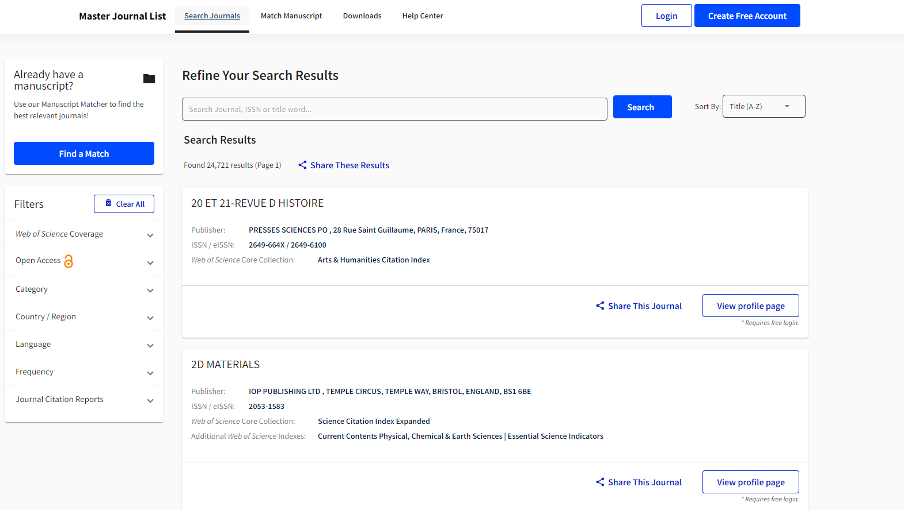

<!-- SHIELDS -->
[![Colab][colab-shield]][colab-url]
[![Contributors][contributors-shield]][contributors-url]
[![MIT License][license-shield]][license-url]
[![Linkedin][linkedin-shield]][linkedin-url]


<!-- PROJECT INTRO -->
<div align="center">
  <h2 align="center">SJR Journal Ranking Analysis</h2>

  <p align="center">
    A web scraping and visualization project on SJR and WoS journal indexes.
    <br />
    <a href="https://public.tableau.com/app/profile/abir.hassan/viz/SJRJournalRankingAnalysis/Dashboard1">View Dashboard</a>
  </p>
</div>

<p align="center">
  
</p>


<!-- TABLE OF CONTENTS -->
<details>
  <summary>Table of Contents</summary>
  <ol>
    <li><a href="#problem-statement">Problem Statement</a></li>
    <li><a href="#built-with">Built With</a></li>
    <li><a href="#installation">Installation</a></li>
    <li><a href="#results">Results</a></li>
  </ol>
</details>

<br>


## Problem Statement

This project is a data scraping, analysis, and visualization project on Research Journals. The project is divided into two parts: the first part is the web scraping part, which is done using Selenium and Python; the second part is the data analysis and visualization part, which is done using Tableau. The project is done as a part of the 1st capstone project of MasterCourse Data Science Cohort 2 program.

The data is scraped from the following websites:

* [Scimago Journal Ranking (SJR)](https://www.scimagojr.com/journalrank.php?wos=true&type=j)
* [Web of Science (WoS)](https://mjl.clarivate.com/search-results)

An external dataset is also used in this project:
* [Scopus](https://www.scopus.com/sources.uri)

<p float="left" align="center">
  
  
</p>

From these 3 sources, the following information is scraped:

* Journal Name or Title
* Subject Area
* Open Access Status
* Publisher
* Country
* Coverage Year
* Journal Rank
* SJR Index
* Quartile
* H-Index
* CiteScore
* References Count
* Citations Count
* Documents Count
...

The scraped data is then cleaned and analyzed using Python libraries such as Pandas, Numpy, Matplotlib, and Seaborn. The cleaned data is then visualized using Tableau. The final dataset can be found in [kaggle][dataset-url].


## Built With

Python libraries and softwares used in this project:

* [![Selenium][Selenium]][Selenium-url]
* [![Pandas][Pandas]][Pandas-url]
* [![Tableau][Tableau]][Tableau-url]


<!-- INSTALLATION -->
## Installation

This project is done using Python 3.11.0. Please install the latest version of Python before running the project.

Below are the steps to run the project:

1. Clone the repo
```bash
git clone https://github.com/abir0/SJR-Journal-Ranking.git
```

2. Intialize and activate virtual environment
```bash
virtualenv --no-site-packages  venv
source venv/bin/activate
```

3. Install dependencies
```bash
pip install -r requirements.txt
```

4. Download Chrome WebDrive from https://chromedriver.chromium.org/downloads and add the path to the `chromedriver.exe` file in PATH environment variable.

5. Run the scraper scripts
```bash
python src/sjr_scraper.py
python src/wos_scraper.py
```

6. Run all the cells in the data transformation and analysis notebook in google colab or download the notebook and run it in Jupyter.

7. You will get a file named `combined_journal_ranking_data.csv`. This is the final data.

8. Open the `SJR Journal Ranking Analysis.twb` file in Tableau (or open the public tableau [link][dashboard-url]) and connect the `combined_journal_ranking_data.csv` file to the workbook.


## Results

The final dashboard can be found [here][dashboard-url].

**Here are the two dashboards:**

### <a href="https://public.tableau.com/app/profile/abir.hassan/viz/SJRJournalRankingAnalysis/Dashboard1"> Dashboard 1 </a>

<p align="center">
  
</p>

### <a href="https://public.tableau.com/app/profile/abir.hassan/viz/SJRJournalRankingAnalysis/Dashboard2"> Dashboard 2 </a>

<p align="center">
  
</p>


**Key findings from the analysis:**

* From the correlation analysis, it is found that there is a positive correlation between SJR Index and CiteScore, H-index, and Cites per Docs. So, these metrics are better indicators than the simple counts of citations, references, and documents.
* But for lower-ranking journals, these metrics do not represent much significance due to higher randomness (note that correlation plots get more scattered to the right).
* Open Access journals have a higher average of Citations per Document than non-Open Access journals.
* One interesting observation: based on the number of documents, citations, and references MDPI is among the top 5 publishers. This is because MDPI publishes a lot of journals, but the quality of the journals is not as high as the top 5 publishers which is reflected by the poor CiteScore.
* Based on CiteScore, the top 5 publishers are: Wiley, Elsevier, Springer, Nature Portfolio, and Routledge.
* The top 5 countries with the highest number of journals are: United States, United Kingdom, Netherlands, Germany, and Switzerland.
* Medicine and Social Sciences are the top 2 subject areas that have the most number of documents, references, and combined H-index.


<!-- MARKDOWN LINKS & IMAGES -->
[dashboard-url]: https://public.tableau.com/app/profile/abir.hassan/viz/SJRJournalRankingAnalysis/Dashboard1
[dataset-url]: https://kaggle.com/datasets/235a681e6dc048c6ad80cc06a905dc3b312215637c3699b008461adf0293753c
[colab-shield]: https://colab.research.google.com/assets/colab-badge.svg
[colab-url]: https://colab.research.google.com/drive/1JOD7DR_buhNnyEeWJxfci4bJ1VLvGCh0?usp=sharing
[contributors-shield]: https://img.shields.io/github/contributors/abir0/SJR-Journal-Ranking.svg
[contributors-url]: https://github.com/abir0/SJR-Journal-Ranking/graphs/contributors
[license-shield]: https://img.shields.io/github/license/abir0/SJR-Journal-Ranking.svg
[license-url]: https://github.com/abir0/SJR-Journal-Ranking/blob/master/LICENSE.txt
[linkedin-shield]: https://img.shields.io/badge/-LinkedIn-black.svg?logo=linkedin&colorB=555
[linkedin-url]: https://linkedin.com/in/abir0

[Selenium]: https://img.shields.io/badge/-selenium-%43B02A?style=for-the-badge&logo=selenium&logoColor=white
[Pandas]: https://img.shields.io/badge/pandas-%23150458.svg?style=for-the-badge&logo=pandas&logoColor=white
[Numpy]: https://img.shields.io/badge/numpy-%23013243.svg?style=for-the-badge&logo=numpy&logoColor=white
[Matplotlib]: https://img.shields.io/badge/Matplotlib-%23ffffff.svg?style=for-the-badge&logo=Matplotlib&logoColor=black
[Seaborn]: https://img.shields.io/badge/Seaborn-%23000000.svg?style=for-the-badge&logo=Matplotlib&logoColor=blue
[Tableau]: https://img.shields.io/badge/Tableau-%23ffffff.svg?style=for-the-badge&logo=Matplotlib&logoColor=black
[Selenium-url]: https://www.selenium.dev/
[Pandas-url]: https://pandas.pydata.org/
[Tableau-url]: https://public.tableau.com/app/discover
